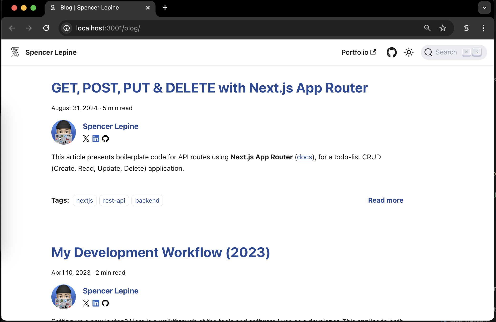
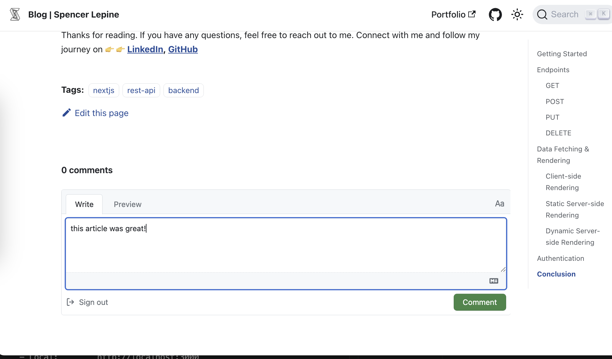
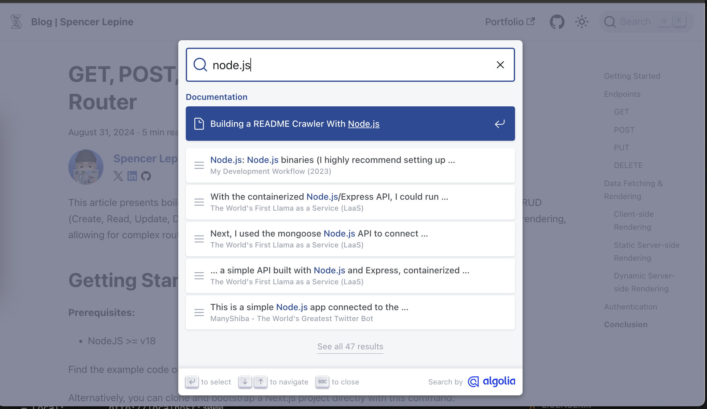
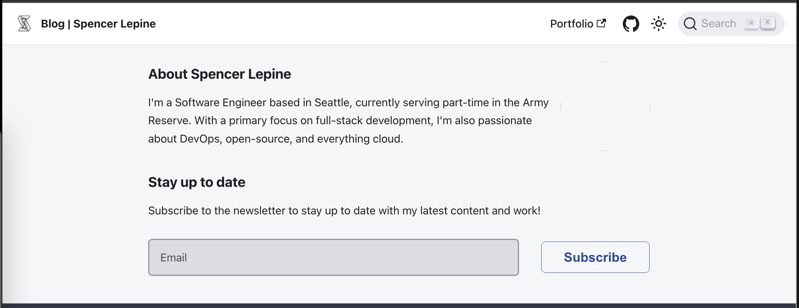

# blog 

Personal developer blog, built with [Docusaurus V3](https://docusaurus.io) and MDX content.



## Built With

- **Node.js**: `>=v18`
- **Docusaurus**: `v3` ([documentation](https://docusaurus.io/docs))
- **MDX Content** (Markdown)
- **GitHub Actions** ([documentation](https://docs.github.com/actions))

## Links

- https://spencerlepine.com/blog
- https://spencerlepine.medium.com
- https://dev.to/spencerlepine

## Features

 _Leave comments on posts (using [Giscus](https://giscus.app/))_

 _Search blog content (using [Algolio](https://www.algolia.com/))_

 _Subscribe to the newsletter (using [HeroTofu](https://herotofu.com/))_

## Local Development

### Prerequisites

- **Node.js:** Download and install from https://nodejs.org/en (includes npm)

### Run Locally

```sh
$ npm install
$ npm start
# view on http://localhost:3000
```

### Production Build

```sh
$ npm run build
```

This command generates static content into the `build` directory and can be served using any static contents hosting service.

## License

[MIT](./LICENSE.txt)
