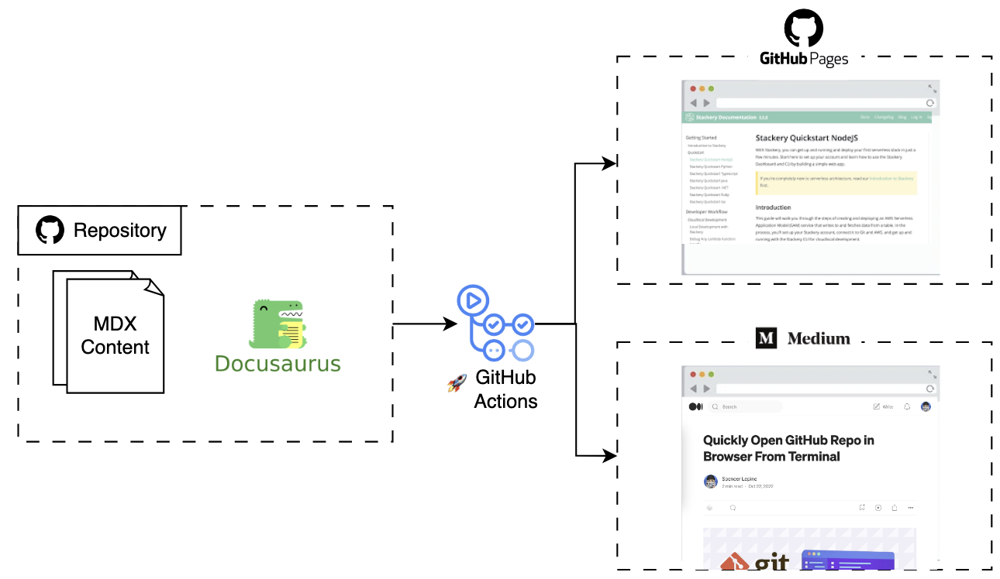
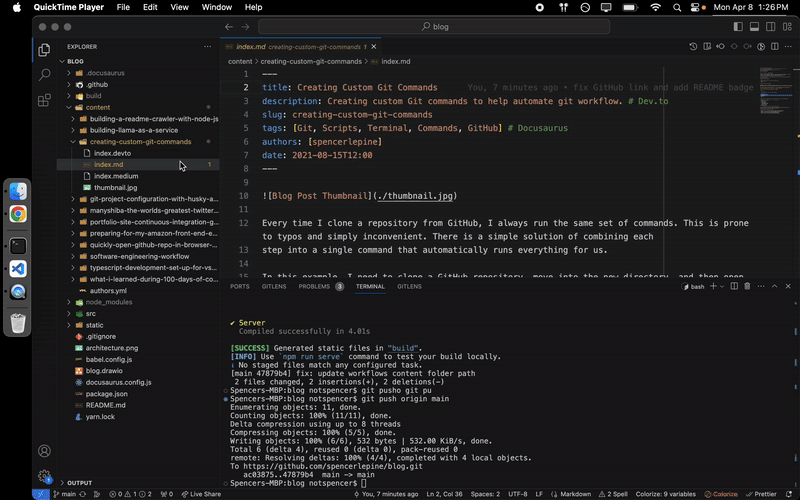

# Spencer Lepine Blog Site [![[Deploy] GitHub Pages](https://github.com/spencerlepine/blog/actions/workflows/github-pages-deploy.yml/badge.svg?branch=main)](https://github.com/spencerlepine/blog/actions/workflows/github-pages-deploy.yml)

Personal blog site built with MDX and [Docusaurus](https://docusaurus.io/), hosted for free on [GitHub pages](https://pages.github.com/). This project includes automated workflows
to cross-publish articles to [Medium](https://medium.com/@spencerlepine) and [Dev.to](https://dev.to/spencerlepine) as well.




## ⭐ Features

- **Automated Deployments:** free hosting and automated CD with [GitHub pages](https://pages.github.com/)
- **Auto-generated Website:** [Docusaurus](https://docusaurus.io/) to create static files for a modern blog UI
- **Medium Publishing:** GitHub Actions workflow to publish articles to Medium account
- **Dev.to Publishing:** GitHub Actions workflow to publish articles to Dev.to account
- **Linter:** pre-commit hook to enforce consistent Markdown formatting
- **Automated Image Optimizer:** a [GitHub Actions](https://github.com/features/actions) workflow using [CalibreApp](https://github.com/calibreapp/image-actions) to compress images
  on every pull request

## Publishing Articles

Create a new folder with the article markdown file and thumbnail image. Docusuarus will automatically deploy this to GitHub Pages.

```
/content
  /new-article-folder-name
    index.md
    thumbnail.jpg
```

### Cross-Posting

Once you have published an article to the GitHub Pages blog, you can cross-post the article to Medium or Dev.to with very little additional effort.

Open the following workflows on GitHub, and enter the folder name when triggering a
[manual dispatch](https://docs.github.com/en/actions/using-workflows/manually-running-a-workflow#configuring-a-workflow-to-run-manually):

- Dev.to: https://github.com/spencerlepine/blog/actions/workflows/post-to-dev-to.yml
- Medium: https://github.com/spencerlepine/blog/actions/workflows/post-to-medium.yml



## 🛠️ Development

### Local Development

```sh
$ yarn install
$ yarn start
```

This command starts a local development server and opens up a browser window. Most changes are reflected live without having to restart the server.

### Production Build

```sh
$ yarn run build
```

This command generates static content into the `build` directory and can be served using any static contents hosting service.

## ℹ️ Specifications

- Launched: March 2023
- Docusaurus: `v3.1.0`
- Links:
  - https://spencerlepine.github.io/blog
  - https://spencerlepine.medium.com
  - https://dev.to/spencerlepine
