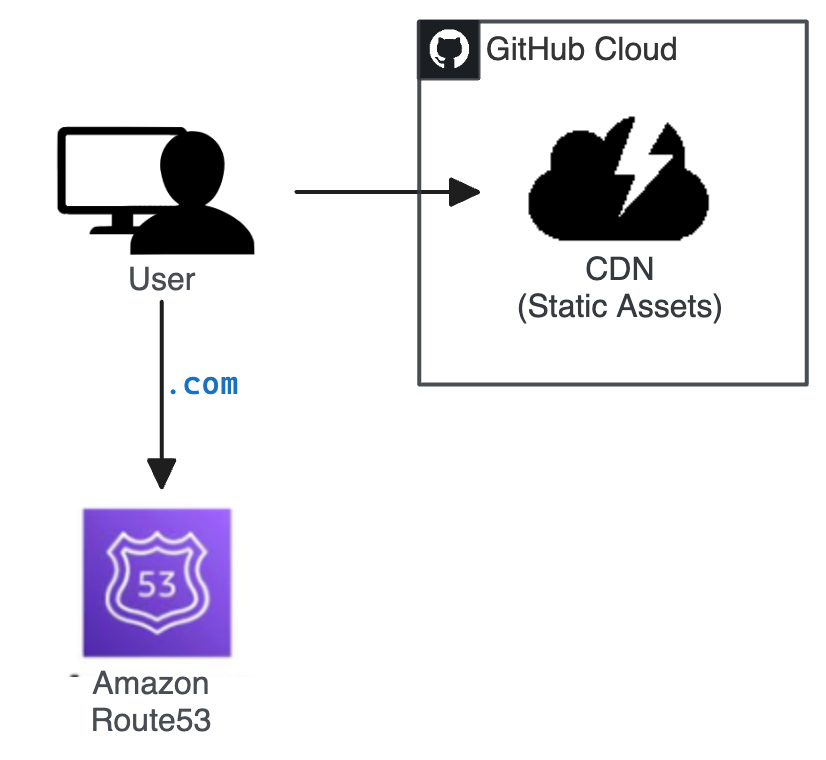
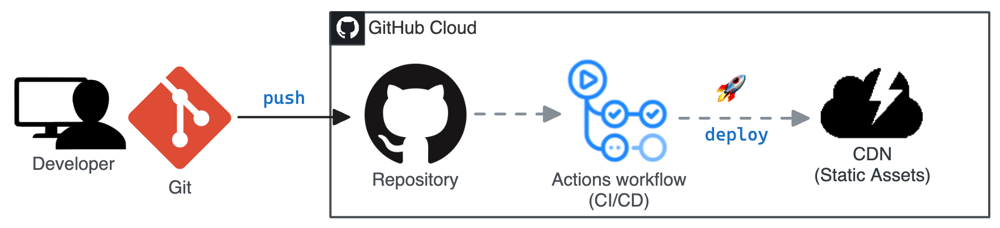

# [blog.spencerlepine.com](https://blog.spencerlepine.com)


[](https://github.com/spencerlepine/blog.spencerlepine.com/actions/workflows/github-pages-deploy.yml)

Personal developer blog. Built with [Docusaurus V3](https://docusaurus.io) and MDX content.

> Note: this repository also includes **GitHub Actions workflows** to cross-post an article to [Medium.com](https://medium.com) or [Dev.to](https://dev.to)


## Built With

- **Node.js**: `>=v18`
- **Docusaurus**: `v3` ([documentation](https://docusaurus.io/docs))
- **MDX Content** (Markdown)
- **GitHub Actions** ([documentation](https://docs.github.com/actions))
- **GitHub Pages** ([documentations](https://docs.github.com/pages))

## Links

- https://blog.spencerlepine.com
- https://spencerlepine.medium.com
- https://dev.to/spencerlepine

## Architecture



## Cross-posting


## Deployment



## Local Development

```sh
$ yarn install
$ yarn start
# view on http://localhost:3000
```

### Production Build

```sh
$ yarn run build
```

This command generates static content into the `build` directory and can be served using any static contents hosting service.

## TODO

- Migrate to custom domain (blog.spencerlepine.com)
- Add Algolia integration

## License

[MIT](./LICENSE.txt)
