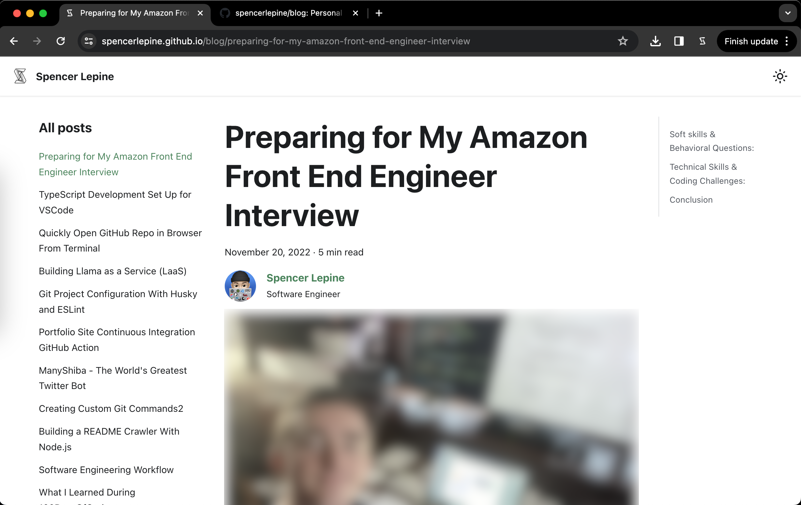
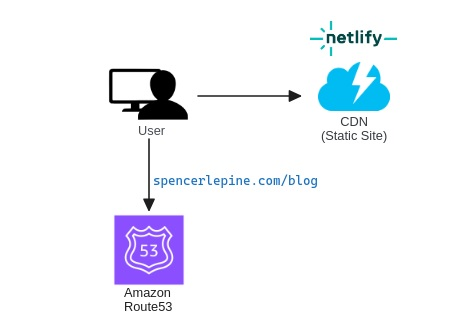
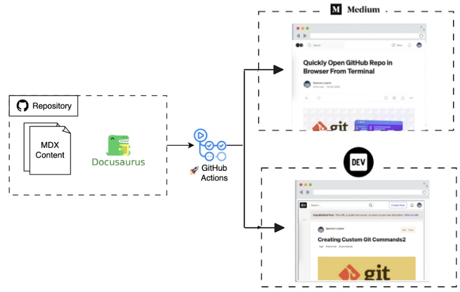
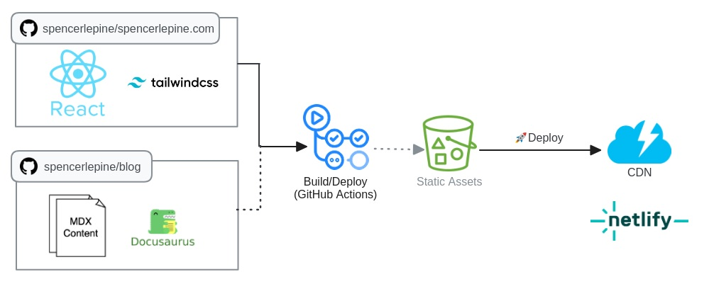

# Developer Blog  [](https://github.com/spencerlepine/spencerlepine.com/actions/workflows/netlify.yml)

My personal developer blog ([spencerlepine.com/blog](https://spencerlepine.com/blog), a static site built from MDX content. This repository includes automated workflows for cross-posting each article to [Medium.com](https://medium.com) and [Dev.to](https://dev.to) (using GitHub Actions)



## Built With

- **Docusaurus**: `v3.1.0` ([documentation](https://docusaurus.io/docs))
- **Node.js**: `>=v18`
- **MDX Content** (Markdown)
- **GitHub Actions** ([documentation](https://docs.github.com/actions))
- **Medium API** ([documentation](https://developers.medium.com/))
- **Dev.to API** ([documentation](https://dev.to/t/api))

## Links

- https://spencerlepine.com/blog
- https://spencerlepine.medium.com
- https://dev.to/spencerlepine

## Architecture



## Cross-posting



## Deployment



## Local Development

```sh
$ yarn install
$ yarn start
# view on http://localhost:3000
```

This command starts a local development server and opens up a browser window. Most changes are reflected live without having to restart the server.

### Production Build

```sh
$ yarn run build
```

This command generates static content into the `build` directory and can be served using any static contents hosting service.

## Documentation

- Post article to personal blog: [docs/publish-personal-blog-article.md](./docs/publish-personal-blog-article.md)
- Set/update GitHub Secrets: https://docs.github.com/actions/security-guides/encrypted-secrets
- Cross-posting to Medium.com: [docs/publish-medium-article.md](./docs/publish-medium-article.md)
- Cross-posting to Dev.to: [docs/publish-devto-article.md](./docs/publish-devto-article.md)

## TODO

- add actions/ folder, add repos (archive/delete the old two forks)
- Update spencerlepine.com/package.json build script to clone and download blog assets
