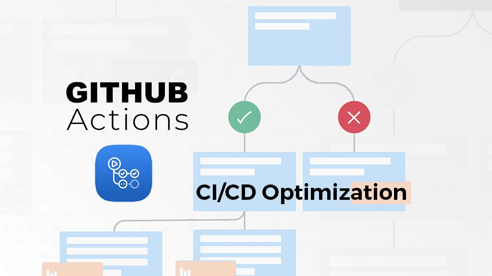

After learning about GatsbyJS and building a static Portfolio site and blog, I searched for systems to deploy this website. At this point, I had purchased the domain name through AWS Route53, but I still needed somewhere to host the static files.

I chose to deploy the site through Digital Ocean Droplet. This was a remote Ubuntu virtual machine with an IP address I could route to. Once I installed apache web server software and connected domain name, the website was live.

There was still one problem with this deployment process. Updating the website took several steps. After local development, I needed to build/generate the static files with Gatbsy locally, and push them to the GitHub repo. Then, I would ssh into the Ubuntu Droplet, clone the updated repo again, and replace the static files for apache to serve.

Steps to deploy were repetitive. Having to remember terminal commands and finding passwords was inconvenient. I was unable to build the static files on the remote Ubuntu machine with limited hardware specs.

One improvement I made was writing a script to delete and copy new files when deploying on Digital Ocean. This addition did not solve everything, as I hard-coded my github username and repository name.

```sh
# RUN the script:
# sudo ./syncBuild.sh portfolio-site

GITHUB_LINK="https://github.com/spencerlepine/$1.git"

git clone "$GITHUB_LINK"
echo -e "$GREEN successfully cloned repo$NC \n"

echo "Removing the current public folder"
rm -r -d public
echo "Moving into the github repo folder"
cd $1
echo "Moving public folder contents OUT of repo folder"
mv public ..
echo -e "$GREEN Successfully copy news files $NC \n"
echo "Moving back into parent directory"
cd ..

echo "Deleting leftover github repo files"
rm -d -r  "$1"

echo "Restarting apache server"
systemctl restart apache2

echo -e "$GREEN Public folder sync complete! $NC"

echo "Visit: spencerlepine.com"

# "syncBuild.sh" 52L, 956C
```
Although this process took less than 10 minutes, switching between the IDE, GitHub, the terminal, and the browser was annoying. It would be better to automate this process. To do that, we can use a GitHub action that will trigger on every repository update. A handy feature of GitHub repositories is the ability to store secrets/environment variables. We can use this to store passwords directly connected to the repository, so all credentials needed for the project are stored in one place.

	Let’s create the GitHub workflow file:
```
name: CI

on:
  push:
    branches: [ master ]

jobs:

  deploy:
    name: Deploy
    runs-on: ubuntu-latest
    steps:
    - name: Deploy Static Files
      uses: appleboy/ssh-action@master
      with:
        host: ${{ secrets.HOST }}
        username: ${{ secrets.USERNAME }}
        key: ${{ secrets.KEY }}
        passphrase: ${{ secrets.PASSPHRASE }}
        port: ${{ secrets.PORT }}
        script_stop: true
        script: |
          # change directory to where website files are stored
          # clone the repository
          # remove the current public folder w/ static files
          # enter the repo folder
          # extract the public folder from the repo folder
          # remove the leftover GitHub repo files
          # restart the web server
          echo “Visit deployed site: spencerlepine.com”
```

### Conclusion
This GitHub action will use another [ssh-action](https://github.com/appleboy/ssh-action) action to handle the remote ssh connection. After storing the connection credentials in the GitHub repository secrets, this can securely/dynamically connect to the remote Ubuntu machine. The last key for this action job is the script, or verbatim Ubuntu commands that will be run. For the sake of brevity, I have only written pseudo-code for the deployment steps.

With this file saved in the `.github` folder in the project,  GitHub can execute the action and connect to our remote server autonomously. After adding a blog post or updating the website, the only step required is pushing the code to GitHub (which I would do anyways). Now, the GitHub workflow will handle all of the steps to connect to the host server, delete old static files, and download the fresh static files.

The continuous integration for this website is completely automated now. This saves me time and effort. No need to worry about forgetting how to deploy later on.

---

View the source code on [GitHub](https://github.com/spencerlepine/spencerlepine.com).

Also find me here:
* [Twitter (@spencerlepine)](https://twitter.com/SpencerLepine)
* [GitHub (@spencerlepine)](https://github.com/spencerlepine)
* [LinkedIn](https://www.linkedin.com/in/spencer-lepine/)
* [YouTube (Spencer Lepine)](https://www.youtube.com/channel/UCBL6vAHJZqUlyJp-rcFU55Q)
