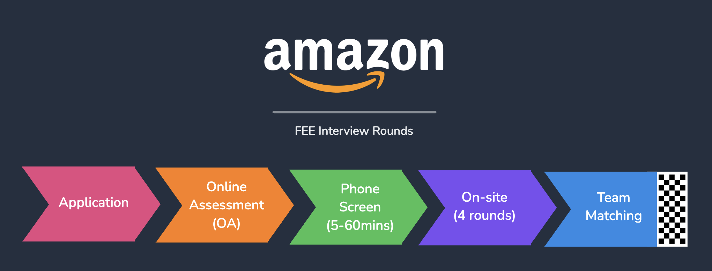

This article covers all the study material and advice that helped me ace my **Amazon Front-End Engineer I (FEE)** interview (November 2022, remote onsite). This is relevant to both the 60min phone interview and final round on-site. <!-- truncate --> I’ll break it down into two sections, technical and behavioral.

> Note, if you’re brand new to the FEE role, I’d recommend skimming through [this article](https://www.interviewkickstart.com/blogs/companies/amazon-front-end-engineer-interview-prep) first.

## Interview Stages

The initial **60-minute phone screen** is typically more laid back, but still focused. It’s an opportunity to talk about your background and motivation to work at Amazon. You’ll want to be up to speed with LeetCode-style problems (mostly medium, rarely hard) and familiarized with the LPs (Leadership Principles).

For the **full on-site**, I’d recommend reviewing this entire article.

Here’s brief visual for the interview pipeline at Amazon:

_Amazon Interview Stages: Application → Online Assessment (OA) → Phone Screen (60min) → Onsite (4 rounds) → Team Matching_

## Technical Skills & Coding Challenges

You likely won’t use an IDE during the interview, allowing you to focus on the concept/design, instead of wasting time on bugs. In my job-hunt experience, this style of using plain JS/CSS/HTML was unique to Amazon and I took some time to brush up on vanilla JS.

Here’s a breakdown of what I studied for the technical portion:

- LeetCode problems (mostly medium, a few hard)
- Verbalizing your thought process
- Vanilla JS and DOM API (practice building simple widgets)
- Frontend system design basics

For the online assessment (OA) and **coding challenges**, it’s best to practice LeetCode style problems (medium difficulty, rarely high). When solving these problems, I briefly think about edge-cases/constraints, write all the psuedo-code, then attempt the problem. Don’t hesitate to check in with the interviewer at checkpoints, asking if you’re on track or they have any thoughts. Even if you don’t solve 100% of the problem, an interviewer still values the progress you make.

It’s critical to verbalize your thought process while solving problem. Whether you are explaining your implementation, or thinking through the problem, the interviewer is assessing how you work through it. Avoid going silent if possible. I pretty awkward at this, so to practice I did talked through LeetCode problems in recorded mock Zoom meetings (like this video)

For the **on-site final round**, you’ll work on a frontend system-design question, which will be solved using vanilla JS, CSS, and HTML (including DOM API). Keep in mind that the difficulty level may vary based on your experience, potentially covering a broader scope than outlined in this article.. Note, this could vary based on your level of experience, so difficulty level could be a larger scope than this article. You may need to brush up on the DOM methods and syntax. I recommend building several small widgets to practice. Make sure you understand selectors, event listeners, and modifying styles with JS. If you are unsure what kinds of widgets I am talking about, look through [this](https://www.frontendinterviewhandbook.com/companies/amazon-front-end-interview-questions) page.

Make sure you understand **frontend system design basic**: component design, state management, performance optimizations, and APIs. To delve into this check out this [playlist](https://www.youtube.com/playlist?list=PLI9W87-Dqn7j_x6QtR6sUjycJR7nQLBqT) with TONS of detailed videos.

### Example Questions

- Find the missing number in the array
- Determine if the sum of two integers is equal to the given value
- Merge two sorted linked lists
- Copy linked list with arbitrary pointer
- Copy linked list with arbitrary pointer
- (system design) Design a restaurant listing application where user can make orders and customize their orders by adding additional stuffs like toppings, salads etc. ([example](https://leetcode.com/discuss/interview-question/1984996/Amazon-Virtual-Onsite-April-2022-FrontEnd-Engineer-II-(L5)Vancouver-Offer/1528383))
- (system design) Design an accordion component

### Resources

- LeetCode Questions: [Amazon Interview Questions (2024) | Glassdoor](https://www.glassdoor.com/Interview/Amazon-Interview-Questions-E6036.htm)
- LeetCode Questions: [Amazon-Tagged Leetcode Questions (wuyaheng.github.io)](https://wuyaheng.github.io/Amazon-Tagged-Leetcode-Questions/)
- Design Questions: [Amazon Front End Interview Questions | The Official Front End Interview Handbook 2024](https://www.frontendinterviewhandbook.com/companies/amazon-front-end-interview-questions)
- Article: [https://www.educative.io/blog/crack-amazon-coding-interview-questions](https://www.educative.io/blog/crack-amazon-coding-interview-questions)
- Video Playlist (Frontend System Design): [https://www.youtube.com/playlist?list=PLI9W87-Dqn7j_x6QtR6sUjycJR7nQLBqT](https://www.youtube.com/playlist?list=PLI9W87-Dqn7j_x6QtR6sUjycJR7nQLBqT)

## Soft Skills & Behavioral Questions

Each interview will include a behavioral question relating to one of the 16 LPs. You don’t have to be an expert, but take some time to learn & familiarize yourself with them.

My advice would be to prepare 1-2 stories per LP before the interview, as you will need to share concise answers on the spot. I’d recommend jotting down keywords for each story to reference. These can be related to work experience, internships, school projects, personal projects, volunteering, extracurriculars, or any situation where you demonstrated leadership, problem-solving, or collaboration. It doesn't have to be strictly work-related.
To tell a concise/structured story, you can use the [STAR framework](https://interviewsteps.com/blogs/news/amazon-star-method), or slightly adapt it. STAR helps to give clearer context and outcomes.

An important theme is that technical skills can easily be taught, soft skills cannot. A valuable candidate has great personality and team collaboration skills.

### Example Questions

- Why Amazon? (watch an example answer from an ex-Amazon interviewer)
- Tell me about a time you failed at work. What did you learn from it?
- Tell me about a challenge you faced. What was your role & the outcome?
- Tell me about a time you disagreed with a coworker/manager/decision
- Tell me about a time you had to work or make a decision quickly / under a tight deadline

### Resources

- Article: [Amazon Leadership Principles](https://www.aboutamazon.com/about-us/leadership-principles)
- Article: [Amazon Behavioral Interview Questions (+ answers, method) - IGotAnOffer](https://igotanoffer.com/blogs/tech/amazon-behavioral-interview)
- Article: [Top Amazon Behavioral Interview Questions and Answers - Exponent](https://www.tryexponent.com/blog/how-to-nail-amazons-behavioral-interview-questions)
- Video: [Amazon Behavioral Interview Questions | Leadership Principles Explained](https://www.youtube.com/watch?v=6p1m2nCE7jE&ab_channel=Exponent)

## Additional Resources

In no particular order, here’s a list of more material I found useful:

- Article: [Amazon Front-End Engineer Interview Prep](https://www.interviewkickstart.com/companies/amazon-front-end-engineer-interview-prep)
- Article: [Understanding Amazon’s Front-End Engineering Interview](https://xjamundx.medium.com/understanding-amazons-front-end-engineering-interview-5e9f38b58058)
- Article: [How I Landed a Front-End Engineering Job at Amazon](https://xjamundx.medium.com/how-i-got-a-front-end-engineering-job-at-amazon-807e26c33915)
- Video: [Rejected by Amazon - Frontend and Software Engineer - Full Loop Interview Exp with no degree at all](https://www.youtube.com/watch?v=gTIS4waIpG4&ab_channel=CodePhony)
- Video: [Amazon Front End Interview Prep | Software Engineer](https://www.youtube.com/watch?v=rMWDtxJQIbQ)
- Video: [Amazon Frontend Interview Experience 2022 | Frontend Engineer 2](https://www.youtube.com/watch?v=jI4WfkudBb8)
- Video: [Amazon Interview Experience | Software Engineer](https://www.youtube.com/watch?v=baT3OzbOg5s&ab_channel=KeepOnCoding)
- LeetCode Post: [Amazon Virtual Onsite - FrontEnd Engineer II Offer](https://leetcode.com/discuss/interview-question/694045/amazon-virtual-onsite-frontend-engineer-ii-offer)
- Google search: [“reddit amazon front end engineer”](https://www.google.com/search?q=reddit+amazon+front+end+engineer)

## Conclusion

_TL;DR - practice LeetCode medium, brush up on vanilla JavaScript and CSS fundamentals, verbalize your thought process, prepare stories for each LP, and be confident._

This covers just about everything I used to prepare for my FEE interview. Keep in mind, my interviews were fully remote, and this is biased to my experience for an entry level position.

I hope you found this article useful! If you have any questions and would like to connect, you can find me over on [LinkedIn](https://linkedin.com/in/spencerlepine) or shoot me an [email](mailto:spencer.sayhello@gmail.com).
