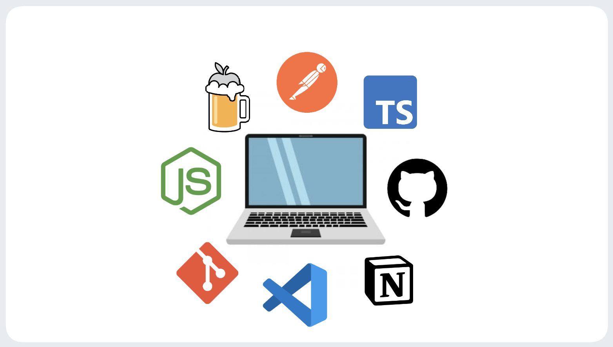

Setting up a new laptop? Here is a walkthrough of the tools and software I use as a developer. This applies to both Windows and Mac.

<!-- truncate -->

### Development

- **[Chrome](https://www.google.com/chrome)**: preferred browser; supports running in no-CORS mode which can be useful during development
- **[VSCode](https://code.visualstudio.com/)**: my go-to IDE. Features/copilot. Read this article
- **[Postman](https://www.postman.com/)**: highly recommended app used for testing APIs (local or production).

### Command Line Tools

- **[Node.js](https://nodejs.org/en/download)**: Node.js binaries (I highly recommend setting up [nmv](https://github.com/nvm-sh/nvm) as well, which allows you to switch between
  Node versions for different projects)
- **[Homebrew](https://brew.sh/)**: package manager for MacOS
- **[Git](https://git-scm.com/)**: make sure to install git (note: it is included with MacOS)
- **GitHub**: login to your GitHub account and configure email/username

### Visuals

Need to create diagrams or thumbnails? The following online tools are perfect for just that:

- **[GIMP](https://www.gimp.org/)**: photo editor (free version of Photoshop). Not as beginner friendly, but useful for creating graphics/logos.
- **[Excalidraw](https://excalidraw.com/)**: user-friendly graph drawing software
- **[Draw.io](https://app.diagrams.net)**: advanced graph drawing software with image search

### Conclusion

That concludes our minimum developer laptop setup, I hope you found this article useful. Feel free to reach out with additional suggestions as well!

Follow my journey and connect with me here:

- LinkedIn: [/in/spencerlepine](https://www.linkedin.com/in/spencerlepine/)
- Email: [spencer.sayhello@gmail.com](mailto:spencer.sayhello@gmail.com)
- Portfolio: [spencerlepine.com](https://spencerlepine.com)
- GitHub: [@spencerlepine](https://github.com/spencerlepine)
- Twitter: [@spencerlepine](https://twitter.com/spencerlepine)
