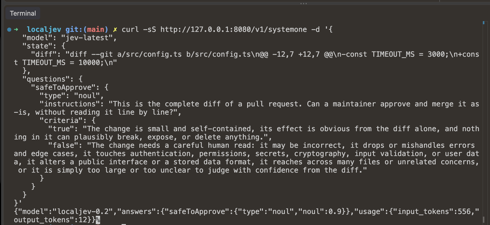

Jev is still behind a waitlist, but you don't have to wait — here's how I got a Jev-compatible endpoint running on my Mac for free, with no API key and no cloud.

<!-- truncate -->



"Jev" is a new proprietary AI decision model released by TypeSafe AI under early access on September 15, 2026. It's taking the dev community by storm, unlocking a new array of
workflow, hook, and AI agent optimizations. You can implement low-latency (under 500ms) decision/branching logic at a fraction of the cost, and significantly reduce overall token spend.

In this article, I'll walk you through how you can set up your own endpoint for free and start prototyping with Jev.

## Problem

This new model sparked a personal wave of curiosity and I couldn't wait to get my hands on it. If it's so cheap, let's get building right away! Unfortunately, TypeSafe AI still has
this endpoint behind a waitlist — huge bummer. After some brief research, it was clear you could EASILY run this locally, for FREE.

People have already built hundreds of useful Jev tools and published them on GitHub, but almost every one requires `TYPESAFE_API_KEY` or `OPENROUTER_API_KEY`, routed to the cloud.
What if we could just run a server on localhost, avoiding cost and vendor lock-in!

## 1. Local LLM Inference Server

I installed a popular tool called oMLX via Homebrew. Super easy. This one installs globally and runs in the background as a local inference server on port `8000`. (See the latest
README instructions, but here's the gist.) Source: https://github.com/jundot/omlx

```sh
brew tap jundot/omlx https://github.com/jundot/omlx
brew install jundot/omlx/omlx
omlx start
```

oMLX ships with ZERO models and only serves what's already sitting in `~/.omlx/models`. The weights come from Hugging Face, so pick a model and pull the files into that folder
yourself:

```sh
M=gemma-4-E4B-it-UD-MLX-4bit
mkdir -p ~/.omlx/models/$M && cd ~/.omlx/models/$M
R=https://huggingface.co/unsloth/$M/resolve/main

for f in config.json generation_config.json chat_template.jinja \
  processor_config.json tokenizer_config.json \
  model.safetensors.index.json tokenizer.json \
  model-00001-of-00002.safetensors model-00002-of-00002.safetensors; do
  curl -fL --retry 3 -sS -o "$f" "$R/$f"
done

# oMLX only scans for models at boot, so restart after adding one.
omlx restart
```

Which model? It depends on how much unified memory you have to spare — the 26B/35B builds are roughly 15GB on disk and won't load on a smaller box. These are the numbers from my
own bake-off (macro accuracy and p50 decision latency, short inputs):

| Your Mac | Model                            | Macro accuracy | p50   |
| -------- | -------------------------------- | -------------- | ----- |
| 16GB     | `gemma-4-E4B-it-UD-MLX-4bit`     | 63.3%          | 0.54s |
| 32GB     | `gemma-4-26b-a4b-it-UD-MLX-4bit` | 75.0%          | 0.68s |
| 64GB+    | `qwen3.6-35b-a3b-ud-mlx-4bit`    | 76.7%          | 0.89s |
| 64GB+    | `diffusiongemma-26B-A4B-it-4bit` | 74.2%          | 1.21s |

I'm on an M1/16GB, where the oMLX process tops out around 9.9GB, so Gemma 4 E4B is the best scorer that actually fits.

## 2. Local Jev Server

Clone this repo. Unlike oMLX, this one just lives in a folder on your machine — nothing is installed globally. (See the latest README instructions, but here's the gist.)

```sh
git clone https://github.com/githubnext/localjev.git
cd localjev
bun install
cp .env.example .env
$EDITOR .env
bun run start
```

Here's the `.env` that I used. The shipped `.env.example` defaults to `diffusiongemma-26B-A4B-it-4bit`, so point `LOCALJEV_UPSTREAM_MODEL` at whatever you actually downloaded
above:

```
LOCALJEV_UPSTREAM=http://127.0.0.1:8000
LOCALJEV_UPSTREAM_API_KEY=replace-with-your-local-omlx-key
LOCALJEV_UPSTREAM_MODEL=gemma-4-E4B-it-UD-MLX-4bit

# Optional: require clients of LocalJev to send this as a Bearer token.
# LOCALJEV_API_KEY=local-dev-key

LOCALJEV_HOST=127.0.0.1
LOCALJEV_PORT=8080
LOCALJEV_TIMEOUT=180
LOCALJEV_MAX_INFLIGHT=2
LOCALJEV_MAX_QUEUE=64
LOCALJEV_MALFORMED_RETRIES=2
LOCALJEV_MAX_OUTPUT_TOKENS=2048
LOCALJEV_QUESTIONS_PER_CALL=16
LOCALJEV_OUTCOMES_PER_CALL=128
```

## 3. Checkpoint

Make sure oMLX and LocalJev are both running:

```sh
curl -s http://127.0.0.1:8000/v1/models   # expect your model in the list
curl -s http://127.0.0.1:8080/ready       # expect {"status":"ready",...}
```

If the first one comes back empty, oMLX never picked up the model directory. If the second one 503s with `inference backend returned HTTP 404`, the model name in `.env` doesn't
match the folder name.

## 4. Usage

Done! You can now easily curl Jev anywhere on your local machine, via CLI, Claude Code hook, and so much more.

Request:

```sh
curl -sS http://127.0.0.1:8080/v1/systemone -d '{
  "model": "jev-latest",
  "state": {
    "diff": "diff --git a/src/config.ts b/src/config.ts\n@@ -12,7 +12,7 @@\n-const TIMEOUT_MS = 3000;\n+const TIMEOUT_MS = 10000;\n"
  },
  "questions": {
    "safeToApprove": {
      "type": "noul",
      "instructions": "This is the complete diff of a pull request. Can a maintainer approve and merge it as-is, without reading it line by line?",
      "criteria": {
        "true": "The change is small and self-contained, its effect is obvious from the diff alone, and nothing in it can plausibly break, expose, or delete anything.",
        "false": "The change needs a careful human read: it may be incorrect, it drops or mishandles errors and edge cases, it touches authentication, permissions, secrets, cryptography, input validation, or user data, it alters a public interface or a stored data format, it reaches across many files or unrelated concerns, or it is simply too large or too unclear to judge with confidence from the diff."
      }
    }
  }
}'
```

Response:

```json
{
  "model": "localjev-0.2",
  "answers": {
    "safeToApprove": {
      "type": "noul",
      "noul": 0.9
    }
  },
  "usage": {
    "input_tokens": 556,
    "output_tokens": 12
  }
}
```

## Next Steps

For more ideas and resources, check out amazing repositories like this one: https://awesomejev.com/
